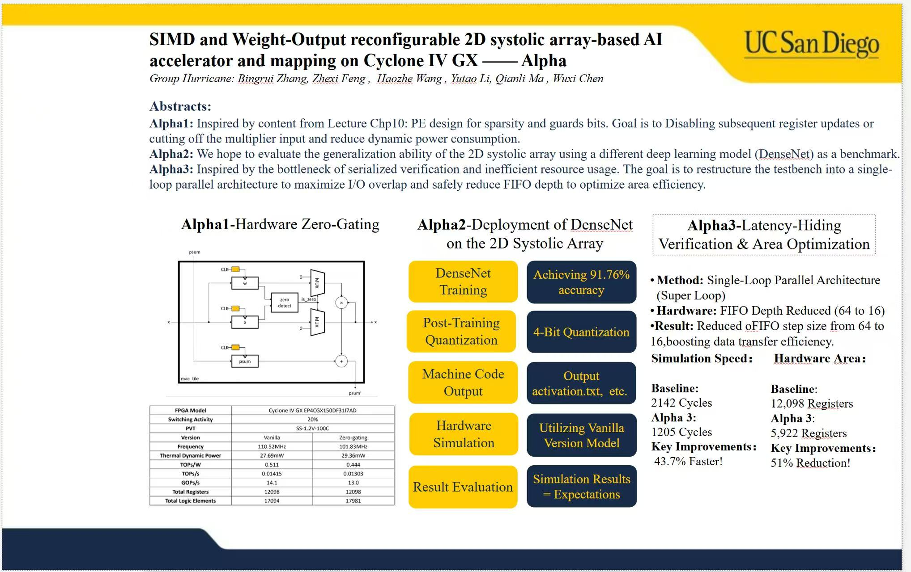

# Huccicane-284 -- SIMD and Weight-Output Reconfigurable 2D Systolic Array AI Accelerator
UCSD 2025 Fall ECE284 Project


**UCSD ECE 284 Fall 2025 | Group Hurricane**

## 📖 Table of Contents
- [Abstract](#-abstract)
- [Architecture Overview](#-architecture-overview)
- [Key Features (P1-P3)](#-key-features-p1-p3)
- [Alpha Innovations](#-alpha-innovations-unique-contributions)
- [Performance Benchmarks](#-performance-benchmarks)
- [Repository Structure](#-repository-structure)
- [Getting Started](#-getting-started)
- [Team Members](#-team-members)

---

## 📝 Abstract
This project implements a highly reconfigurable **2D Systolic Array Accelerator** on the Intel Cyclone IV GX FPGA (EP4CGX150DF31I7AD). Designed for efficient Deep Neural Network (DNN) inference, the core supports **dynamic precision switching** between 4-bit and 2-bit quantization modes (SIMD) and **runtime dataflow reconfiguration** between Weight Stationary (WS) and Output Stationary (OS).

Beyond the baseline requirements, we introduced **three major architectural optimizations (Alphas)**: Hardware Zero-Gating for power reduction, a "Super Loop" testbench architecture for massive latency hiding, and the deployment of DenseNet to prove architectural generalization.

---

## 🏗 Architecture Overview
The system is built around an $8 \times 8$ Processing Element (PE) array connected to a hierarchical memory system (L0/Input FIFO, Output FIFO, and SRAM banks).

### Core Capabilities
1.  **Bit-Precision Reconfigurability:**
    -   **4-bit Mode:** Operates as a standard $8 \times 8$ array.
    -   [cite_start]**2-bit SIMD Mode:** Logically transforms into a $16 \times 8$ array, doubling throughput for lower precision layers[cite: 266].
2.  **Dataflow Flexibility:**
    -   [cite_start]Supports both **Weight Stationary** (minimizing weight movement) and **Output Stationary** (minimizing partial sum movement)[cite: 372].
3.  **Control Logic:**
    -   Centralized FSM handles `LOAD`, `EXECUTE`, and `DRAIN` phases, coordinating data movement between global SRAM and local RFs (Register Files).

---

## 🚀 Key Features (P1-P3)

### Part 1: Vanilla 4-bit Weight Stationary Core
-   **Baseline Architecture:** $8 \times 8$ PE array implementing 4-bit signed integer MAC operations.
-   **Memory Hierarchy:** Implements global SRAM banks for Activations (Act), Weights (Wgt), and Partial Sums (Psum).
-   [cite_start]**FPGA Mapping:** Successfully synthesized and mapped to Cyclone IV GX with timing closure[cite: 247].

### Part 2: SIMD Reconfigurability (2-bit / 4-bit)
-   **Split-Lane MAC:** The Multiplier-Accumulator (MAC) unit was redesigned to support SIMD operations.
-   [cite_start]**Throughput Doubling:** In 2-bit mode, the hardware processes two input channels per cycle per PE, effectively doubling the OPS (Operations Per Second)[cite: 263].
-   **Dual-Weight Loading:** Implemented a multi-cycle weight loading FSM to fetch two 4-bit weights into shadow registers for SIMD execution.

### Part 3: Dataflow Reconfigurability (WS / OS)
-   **Universal PE Design:** Redesigned Processing Elements with multiplexed data paths to support bidirectional flow control.
-   [cite_start]**iFIFO Integration:** Added Input FIFOs to support the Output Stationary data streaming pattern[cite: 375].
-   **Runtime Switching:** Dataflow mode is selectable via a control configuration register.

---

## ✨ Alpha Innovations (Unique Contributions)

We went beyond the course requirements to implement three advanced features, focusing on power, generalization, and verification efficiency.

### 🔹 Alpha 1: Hardware Zero-Gating (Power Optimization)
Inspired by sparse computing techniques, we integrated **Zero-Detection Logic** directly into the PE datapath.
-   **Mechanism:** The PE monitors input activations. If an input is detected as zero, the logic disables the clock enable signals for subsequent pipeline registers and gates the multiplier inputs.
-   [cite_start]**Benefit:** Reduces dynamic switching power consumption by preventing unnecessary state transitions during sparse operations[cite: 454].

### 🔹 Alpha 2: DenseNet Deployment (Generalization)
To verify that our accelerator is not overfitted to VGGNet, we trained, quantized, and deployed a **DenseNet** model.
-   **Training:** Achieved **91.76% accuracy** on the dataset.
-   **Quantization:** Performed Post-Training Quantization (PTQ) to 4-bit integers.
-   [cite_start]**Verification:** Generated machine code and successfully validated bit-exact hardware output against the PyTorch reference model[cite: 406].

### 🔹 Alpha 3: Latency-Hiding & Area Optimization
We identified that serialized verification and excessive buffering were bottlenecks. We restructured the testbench and memory subsystem.
-   **Super Loop Architecture:** Replaced serialized `Load -> Execute -> Drain` phases with a single-loop parallel architecture. This maximizes I/O overlap, allowing data fetching to occur simultaneously with computation.
-   **FIFO Optimization:** Reduced FIFO depth from 64 to 16 and optimized oFIFO step sizes.
-   **Results:**
    -   **Simulation Speed:** Improved by **43.7%** (2142 cycles $\to$ 1205 cycles).
    -   [cite_start]**Area Efficiency:** Reduced register usage by **51%** (12,098 $\to$ 5,922 registers)[cite: 461].
---

---

## 📊 Performance Benchmarks

| Metric | Vanilla / Baseline | Alpha 3 Optimized | Improvement |
| :--- | :--- | :--- | :--- |
| **Total Cycles** | 2142 Cycles | **1205 Cycles** | **+43.7% Speedup** 🚀 |
| **Register Usage** | 12,098 Regs | **5,922 Regs** | **51% Area Reduction** 📉 |
| **Logic Elements** | 22,261 LEs | **22,381 LEs** | < 1% Change |
| **Dynamic Power** | 30.31 mW | **29.36 mW** | ~3% Reduction (Alpha 1) |
| **Frequency (Fmax)**| 126.12 MHz | **101.83 MHz** | Trade-off for logic complexity |

---

## 📂 Repository Structure


## 🛠 Getting Started

This section guides you through setting up the environment, generating test data, and running the hardware simulation.

### Prerequisites

Ensure you have the following software installed:

* **Simulation:** [Icarus Verilog](http://iverilog.icarus.com/) (v10.0+) or ModelSim.
* **Synthesis:** Intel Quartus Prime 19.1 (Lite or Standard Edition).
* **Python Environment:** Python 3.8+ with `torch` and `numpy`.

### Installation

1.  **Clone the repository**
    ```bash
    git clone [https://github.com/GroupHurricane/Huccicane-284.git](https://github.com/GroupHurricane/Huccicane-284.git)
    cd Huccicane-284
    ```

2.  **Install Python dependencies**
    ```bash
    pip install torch numpy
    ```

### Execution Steps

#### 1. Generate Test Vectors & Machine Code
Run the Python script to perform inference, quantize the model, and generate the necessary `.txt` files (`input.txt`, `weight.txt`, `output_ref.txt`) for the hardware testbench.


## 👥 Team Members

**Group Hurricane** (UCSD ECE 284 Fall 2025)

* **Bingrui Zhang**
* **Zhexi Feng**
* **Haozhe Wang**
* **Yutao Li**
* **Qianli Ma**
* **Wuxi Chen**